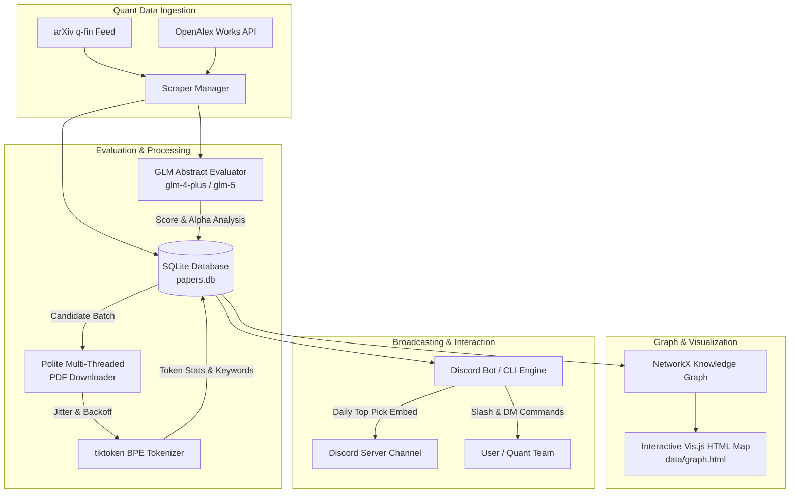

<div align="center">

# 📈 QuantPaperBot
### Autonomous Quantitative Finance Paper Scraper, GLM Evaluator & Knowledge Engine

[](https://www.python.org/downloads/)
[](LICENSE)
[](https://discord.com)
[](https://open.bigmodel.cn/)
[](https://arxiv.org/archive/q-fin)

*A production-grade Python system and 24/7 Discord bot that continuously harvests cutting-edge and classic quantitative finance papers, evaluates mathematical depth and alpha novelty with **GLM**, downloads full-text PDFs with polite multi-threading, tokenizes documents, builds an interactive **Quantitative Knowledge Graph**, and broadcasts the top curated pick daily.*

[Features](#-key-features) • [Architecture](#-architecture) • [One-Click Setup](#-one-click-setup) • [Configuration](#-configuration) • [Discord Commands](#-discord-commands) • [Push to GitHub](#-how-to-push-to-github)

---

</div>

## 📑 Table of Contents
- [🌟 Key Features](#-key-features)
- [🏗 Architecture](#-architecture)
- [⚡ One-Click Setup](#-one-click-setup)
- [⚙️ Configuration](#️-configuration)
  - [Discord Bot Setup](#1-discord-bot-setup)
  - [GLM API Key Setup](#2-glm-api-key-setup)
- [🤖 Discord Commands](#-discord-commands)
- [💻 CLI Usage](#-cli-usage)
- [🕸 Interactive Knowledge Graph](#-interactive-knowledge-graph)
- [📤 How to Push to GitHub](#-how-to-push-to-github)
- [🧪 Running Tests](#-running-tests)
- [📄 License](#-license)

---

## 🌟 Key Features

### 1. Dedicated Quantitative Finance Ingestion
- **arXiv `q-fin`**: Monitors all quantitative subcategories in real time:
  - `q-fin.TR` (Trading & Market Microstructure)
  - `q-fin.PM` (Portfolio Management)
  - `q-fin.CP` (Computational Finance)
  - `q-fin.PR` (Pricing of Securities)
  - `q-fin.RM` (Risk Management)
  - `q-fin.ST` (Statistical Finance)
  - `econ.EM` (Econometrics)
- **OpenAlex Index**: Surfaces classic, high-impact foundational literature (Black-Scholes, Rough Volatility, Pairs Trading, Limit Order Book Dynamics, Hawkes Processes).

### 2. GLM Quantitative Evaluation Engine
- Evaluates abstracts through the persona of a **Director of Quantitative Research at a Systematic Hedge Fund**.
- Scores papers strictly on **mathematical rigor, theoretical validity, microstructure insight, and alpha potential** (filtering out trivial or overfitted backtests).
- Generates structured JSON:
  - **Overall Score (1-100)**
  - **Attention-grabbing hook** for quantitative researchers
  - **Mathematical & Model Innovation** (2-3 sentences)
  - **Alpha & Practical Trading Implication** (1-2 sentences)
  - **Extracted Quant Concepts** (`rough volatility`, `optimal execution`, `hawkes process`, etc.)

### 3. Polite Multi-Threaded PDF Downloader
- Concurrent downloads via `ThreadPoolExecutor` with a synchronized rate-limiter and random jitter.
- Automatic exponential backoff on HTTP 429/503 errors to **prevent IP bans or cancellations from academic servers**.
- Validates PDF binary headers (`%PDF-`), rejecting HTML error/captcha traps.

### 4. Full-Text BPE Tokenizer
- Extracts full text and computes exact token counts using `tiktoken` (`cl100k_base` BPE).
- Profiles section token distributions (Abstract, Intro, Methods/Architecture, Results).
- Extracts high-density domain keywords for graph linking.

### 5. Interactive Knowledge & Alpha Graph
- Builds a multi-relational network connecting papers and quant concepts using `NetworkX`.
- Exports a standalone interactive HTML visualizer ([`data/graph.html`](data/graph.html)) with physics simulation, score color-coding, and cluster exploration.

### 6. Continuous 24/7 Discord Bot
- Runs an automated daily scheduler (`@tasks.loop(hours=24)`).
- Delivers rich Discord embeds with color-coded badges (`🔥 GROUNDBREAKING ALPHA`, `✨ HIGHLY INTERESTING MODEL`, `💡 NOTABLE QUANT RESEARCH`).
- Full support for interactive Slash Commands and DM customization.

---

## 🏗 Architecture



---

## ⚡ One-Click Setup

Launch the application directly using the automated startup scripts (which check Python, initialize a virtual environment, install requirements, and set up `.env`):

### Windows (Double-Click or Command Prompt)
```cmd
start.bat
```
*(Or pass arguments: `start.bat --daily` or `start.bat --search "limit order books"`)*

### Windows (PowerShell)
```powershell
.\start.ps1
```

### Linux / macOS / WSL (Bash)
```bash
chmod +x start.sh
./start.sh
```

---

## ⚙️ Configuration

Copy `.env.example` to `.env`:
```bash
cp .env.example .env
```

Edit `.env` with your API credentials:
```env
DISCORD_TOKEN=your_discord_bot_token_here
DISCORD_CHANNEL_ID=your_target_discord_channel_id_here

GLM_API_KEY=your_glm_api_key_here
GLM_BASE_URL=https://open.bigmodel.cn/api/paas/v4/
GLM_MODEL=glm-4-plus
```

### 1. Discord Bot Setup
1. Go to the [Discord Developer Portal](https://discord.com/developers/applications) and create a **New Application**.
2. Navigate to the **Bot** tab:
   - Click **Reset Token** and copy the token to `DISCORD_TOKEN` in `.env`.
   - Enable **Message Content Intent** under *Privileged Gateway Intents*.
3. Go to **OAuth2 -> URL Generator**:
   - Scopes: `bot`, `applications.commands`
   - Permissions: `Send Messages`, `Embed Links`, `Attach Files`, `Read Message History`
   - Open the generated URL in your browser to invite the bot to your server.
4. Copy the Channel ID where you want daily papers posted into `DISCORD_CHANNEL_ID` in `.env`.

### 2. GLM API Key Setup
- Obtain an API key from [Zhipu AI BigModel Platform](https://open.bigmodel.cn/).
- The client also supports any OpenAI-compatible proxy by updating `GLM_BASE_URL`.
- *Note: If no API key is provided, the system falls back to an intelligent heuristic mock analyzer so you can test the entire pipeline locally without cost.*

### 3. Customizing Curation Settings (`config.yaml`)
You can fine-tune research topics, score thresholds, and concurrency in `config.yaml`:
```yaml
scheduler:
  daily_interval_hours: 24
  candidates_per_fetch: 15
  top_papers_to_post: 1

downloader:
  max_workers: 3              # Parallel threads (polite limit for arXiv)
  request_delay_seconds: 1.5  # Spacing between calls with jitter
  max_retries: 3              # Retries with exponential backoff
  download_all_candidates: true

filters:
  min_score: 75
  interests:
    - "Market Microstructure, Limit Order Books & High-Frequency Trading"
    - "Statistical Arbitrage, Machine Learning & Quantitative Alpha Signals"
    - "Stochastic Volatility Models, Rough Volatility & Exotic Derivatives Pricing"
    - "Portfolio Optimization, Factor Investing & Risk Parity"
    - "Reinforcement Learning for Trade Execution and Market Making"
```

---

## 🤖 Discord Commands

| Slash Command | Description |
| :--- | :--- |
| `/daily_test` | Immediately triggers the complete daily harvest, GLM evaluation, and posting cycle. |
| `/search <query> [limit]` | Searches arXiv & OpenAlex, evaluates papers with GLM, and returns embed cards. |
| `/filter [new_interests]` | Displays active filter settings or updates your topics of interest directly from chat. |
| `/top [count]` | Lists the highest-rated historical quant papers in the local archive. |
| `/graph` | Generates and uploads the interactive `quant_knowledge_graph.html` directly into Discord. |
| `/stats` | Displays local database counts, tokenized PDFs, total corpus tokens, and unique concepts. |

---

## 💻 CLI Usage

The system can run headlessly without Discord via `main.py`:

```bash
# Run a single daily harvest cycle immediately
python main.py --daily

# Search for papers on a specific topic
python main.py --search "rough heston volatility" --limit 5

# Rebuild and export the interactive HTML knowledge graph
python main.py --graph

# View database and tokenization statistics
python main.py --stats

# Run the 24/7 Discord bot daemon
python main.py --bot
```

---

## 🕸 Interactive Knowledge Graph

The knowledge graph connects papers and quantitative finance concepts using shared mathematical foundations and Jaccard similarity:

1. Run `python main.py --graph` (or use `/graph` in Discord).
2. Open [`data/graph.html`](data/graph.html) in any web browser.
3. Features:
   - **Physics simulation**: Clusters related papers naturally around common alpha concepts.
   - **Score Color Badges**: Red (Score ≥ 90), Gold (80-89), Blue (< 80), Teal (Concepts).
   - **Rich Hover Cards**: Displays paper title, score, token count, and venue.

---

## 📤 How to Push to GitHub

This repository is already pre-configured with a `.gitignore` that safely excludes all sensitive API keys (`.env`), downloaded PDFs (`data/pdfs/`), virtual environments (`venv/`), and SQLite databases.

Follow these steps in your terminal to push this project to GitHub:

```bash
# 1. Initialize git repository (if not already initialized)
git init

# 2. Add all files (safe due to .gitignore)
git add .

# 3. Create your initial commit
git commit -m "feat: initial commit for QuantPaperBot"

# 4. Set default branch to main
git branch -M main

# 5. Add your GitHub remote repository (replace with your repo URL)
git remote add origin https://github.com/YOUR_USERNAME/QuantPaperBot.git

# 6. Push code to GitHub
git push -u origin main
```

---

## 🧪 Running Tests

Run the automated test suite to verify database CRUD operations, GLM parsing, tokenization, and multithreading:

```bash
python -m unittest discover tests
```

---

## 📄 License

Distributed under the [MIT License](LICENSE). Free for personal and commercial research use.
